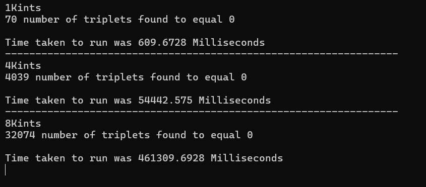
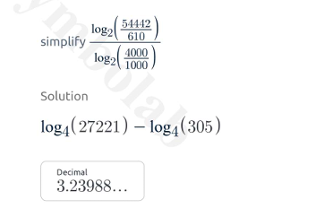


[Section 3 - Introduction to Algorithm Analyis](https://www.udemy.com/course/algorithms-data-structures-csharp/learn/lecture/12727527#overview)

## Problem :question:

>Iterate over a set of integer numbers and find all of the triplets summing which the result will be 0

---

1. **Time Complexity** : How much time will it take to iterate through the integers to find the correct solution  

2. **Space Complexity** : How much memory will be used in iterating through the numbers to find the correct solution 

Sample Data Acquired from Engineer Spocks content download : 

1Kints.txt 

Ex:

 324110    
-442472     
 626686   
-157678   
 508681   
 123414   
 -77867  
 155091   
 129801  
 287381  
 604242  
 

 324110 - 442472 + 626686 = 0 ? N :x:
 
 -442472 + 626686 - 157678 = 0 ? N :x:

 -442472 + 155091 + 287381 = 0 ? Y  :heavy_check_mark:

Results: 

Calculate Slope : 

Roughly 3

=> $log{_2}{(T(n))} = 3log{_2}n  + log{_2}a$ **- a is constant**
=> $log{_2}{(T(n))} = log{_2}a * N^3$
=> $T(n) = aN^3$

References: 

 https://www.symbolab.com/solver/logarithmic-equation-calculator
 https://www.udemy.com/course/algorithms-data-structures-csharp
 