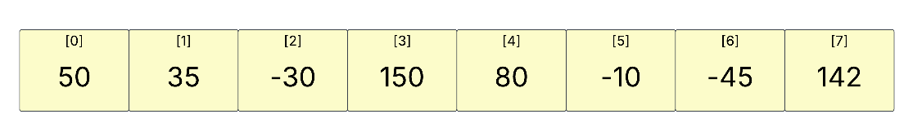

# Insertion Sort Algorithm

## What is Insertion Sort?
Similar to the Selection Sort, where it builds the sorted array from the left to right, but the Insertion Sort takes the first element from the right (unsorted) section of the array and puts it in the correct spot of the left (sorted) segment.

## Array to Sort



## Algorithm
```bash
FOR i = 0 to Array Length
   FOR j = 1 to Array Length
       First Element in [j] moved to correct position in [i]  
   NEXT j
   END FOR
NEXT i
END FOR 
```


## Code 
```CSharp
public class InsertionSort
{
    public static int[] Sort(int[] unsortedArray)
    {
        for (int i = 0; i < unsortedArray.Length; i++)
        {
            int j = i;
            while(j > 0 && unsortedArray[j] < unsortedArray[j-1])
            {
                unsortedArray = swapValues(unsortedArray, j, j-1);
                j--;
            }
        }
        return unsortedArray;
    }
    private static int[] swapValues(int[] array, int indexA, int indexB)
    {
        int temp = array[indexA];
        array[indexA] = array[indexB];
        array[indexB] = temp;
        return array;
    }
}
```
## What is the Time Complexity ?

##### Worst Case 
 $O(n^2)$

##### Average Case
$O(n^2)$

## Why is the Time Complexity $O(n^2)$

Because the sort requires a while loop looping backwards, causing the number of operations to grow quadratically as the inputs get larger

## Adapted From 

- Jamro, M. (2024). C# Data Structures and Algorithms (2nd ed.). Packt Publishing.