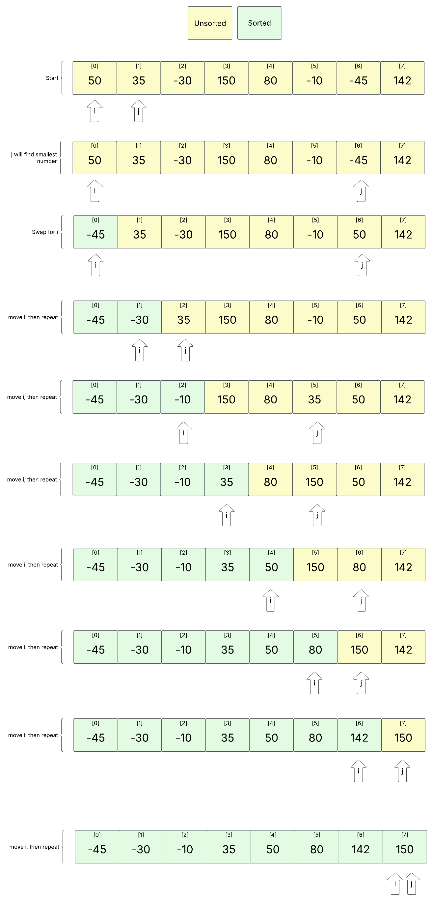

# Selection Sort Algorithm

## What is Selection Sort?
Scans the array  finding the smallest elements and swapping them from the beginning, gradually building the sorted array from the bottom up.

## Array to Sort


## Algorithm
```bash
FOR i = 0 to Array Length
   FOR j = 1 to Array Length
       Smallest Value in [j] moved to Array[i]  
   NEXT j
   END FOR
NEXT i
END FOR 
```


## What is the Time Complexity ?

##### Worst Case 
 $O(n^2)$

##### Average Case
$O(n^2)$

## Why is the Time Complexity $O(n^2)$

Because the sort requires a nested for loop, causing the number of operations to grow quadratically as the inputs get larger

