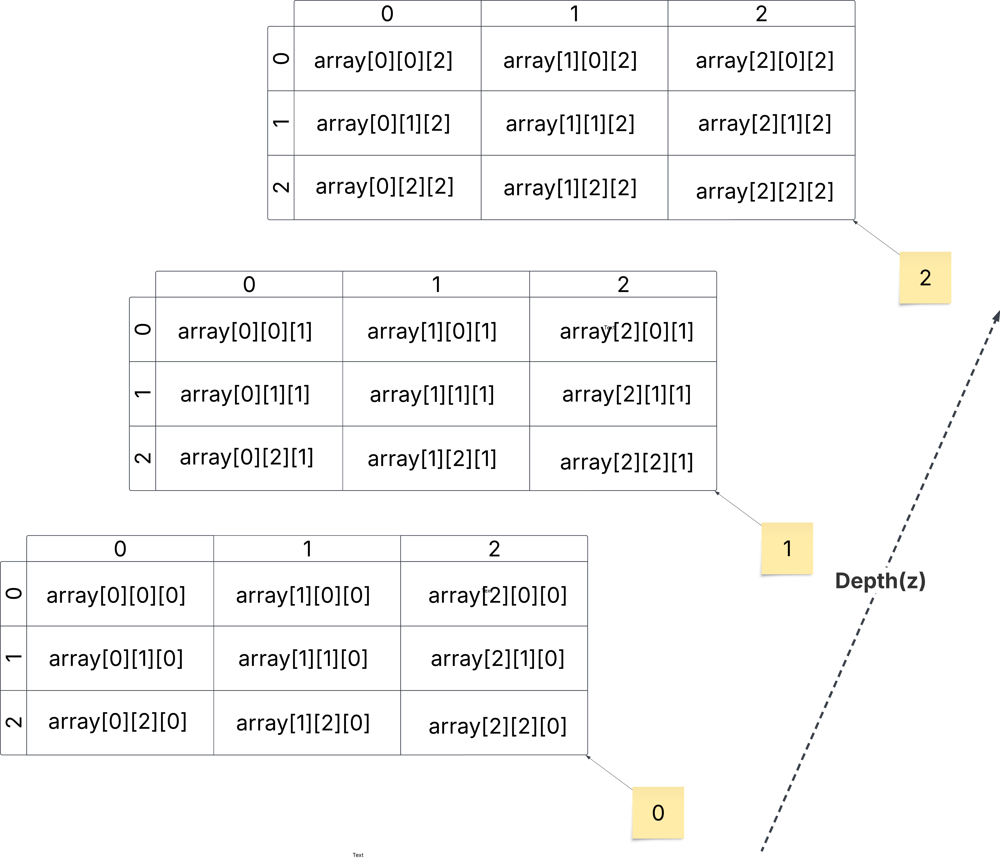
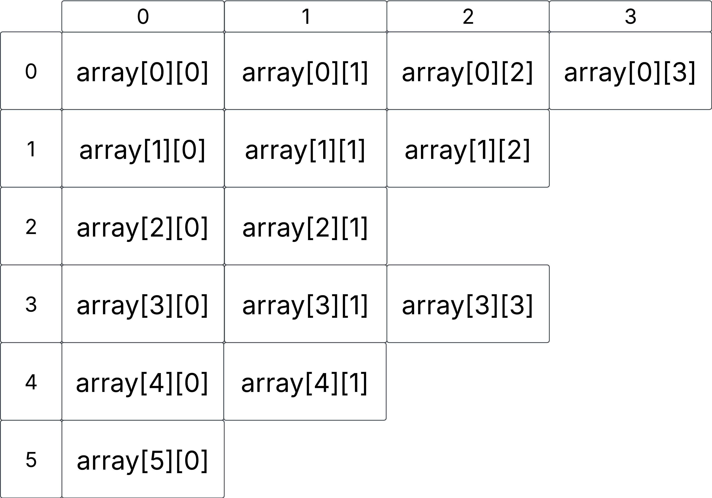

# Arrays 
## Single Dimensional Array 

Array of Integers

```CSharp
int[] array = new int[10] {1, 2, 3, 4, 5, 6, 7, 8, 9, 10};
``` 


## Two Dimensional Array

 Two Dimensional Array of Integers

```CSharp
int[,] array = new int[4,4] {
                              {1,2,3,4},
                              {1,2,3,4},
                              {1,2,3,4},
                              {1,2,3,4}
                            };
``` 


## Three Dimensional Array

Three Dimensional Array of Integers

```CSharp
int[,,] array = new int[3,3,3] {
                                {{1,2,3},{1,2,3},{1,2,3}},
                                {{1,2,3},{1,2,3},{1,2,3}},
                                {{1,2,3},{1,2,3},{1,2,3}}
                              };
``` 




## Jagged Array

```CSharp
int[][] array = new int[5][];
array[0] = [1,2,3,4];
array[1] = [1,2,3];
array[2] = [1,2];
array[3] = [1,2,3];
array[4] = [1,2];
array[5] = [1];

``` 


