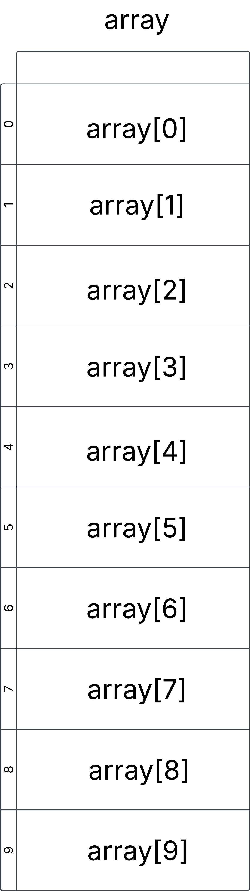
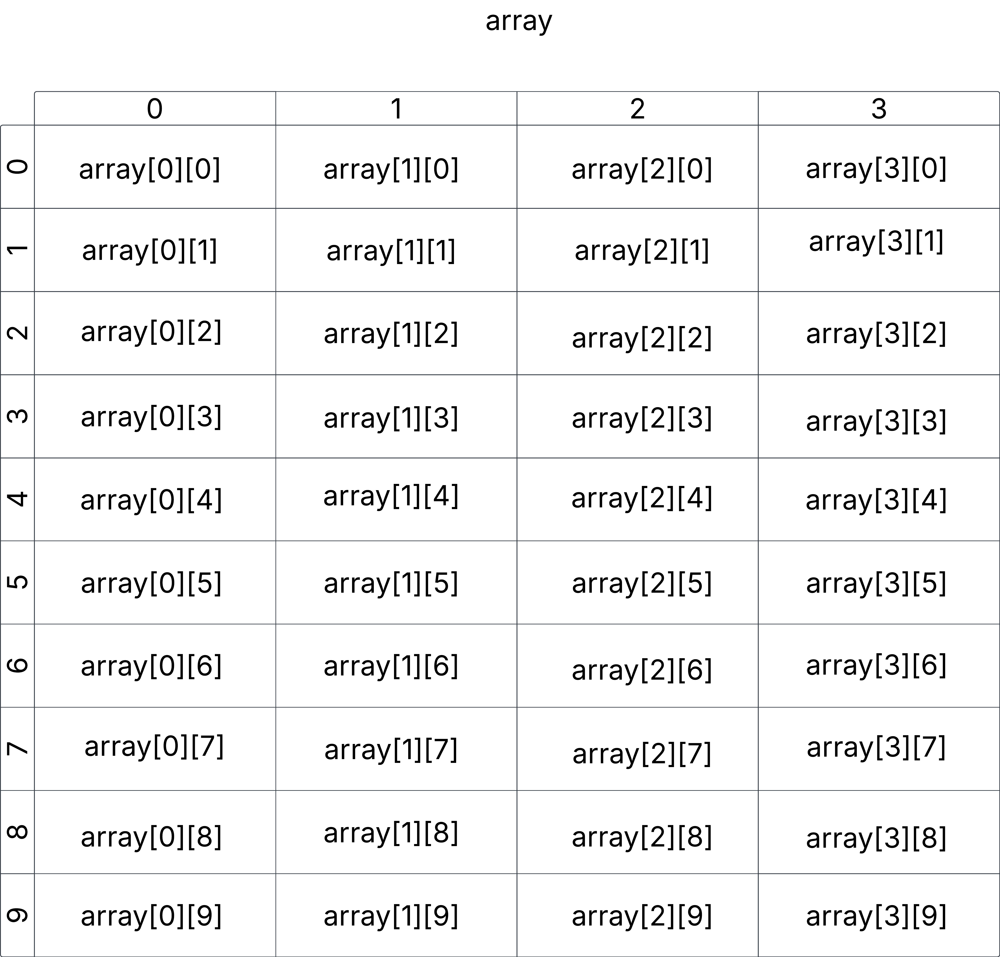

# Arrays 

## Single Dimensional Array 

Array of Integers

```CSharp
int[] array = new int[10];
array = [1, 2, 3, 4, 5, 6, 7, 8, 9, 10];
``` 


## Two Dimensional Array


## Three Dimensional Array

## Jagged Array

