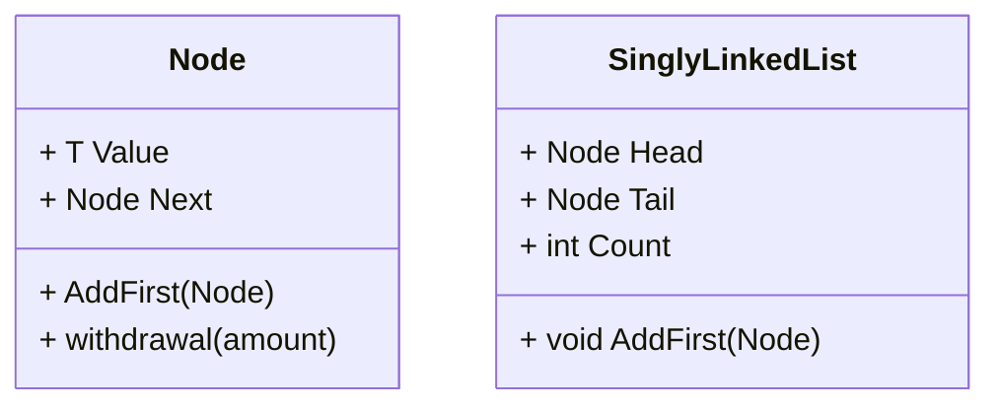

## Linked Lists

## Singly Linked List 

### UML Diagrams

``` mermaid

classDiagram
class Node
Node : + T Value
Node : + Node Next
Node : + AddFirst(Node)
Node : + withdrawal(amount)

class SinglyLinkedList
SinglyLinkedList : + Node Head
SinglyLinkedList : + Node Tail
SinglyLinkedList : + int Count
SinglyLinkedList : + void AddFirst(Node<T>)

```

---

