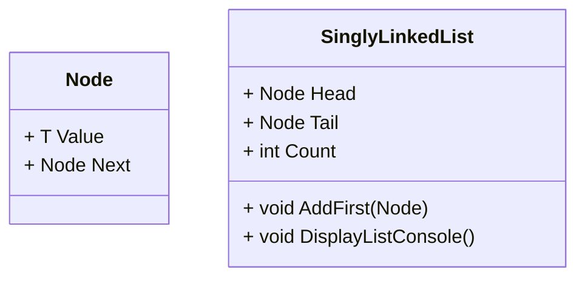

## Linked Lists

## Singly Linked List 

### UML Diagrams

``` mermaid

classDiagram
class Node
Node : + T Value
Node : + Node Next

class SinglyLinkedList
SinglyLinkedList : + Node Head
SinglyLinkedList : + Node Tail
SinglyLinkedList : + int Count
SinglyLinkedList : + void AddFirst(Node<T>)
SinglyLinkedList : + void DisplayListConsole()

```

---

