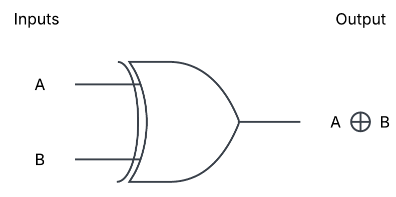
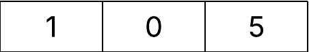
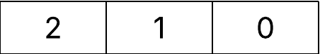

## Dynamic Array Breakdown
---

### Illustration of Problem

### What is XOR - Exclusive OR ?

> **When both inputs are the same, then the output is false (0)**
> **When both inputs are different, then the output is true (1)**

| A | B | A $\oplus$ B |
|---|---|:------------:|
| 0 | 0 |      0       |
| 0 | 1 |      1       |
| 1 | 0 |      1       |
| 1 | 1 |      0       |

### Query Processing

#### 2 Types of Queries to process 

> There was an error in the description and the idx should be computed with modulo %

1. Query: 1 $x$ $y$
    a. **Compute *idx* = ($x \oplus lastAnswer$) % n** 
    b. **Append the integer $y$ to $arr[idx]$**

>**Example with Query 1 :**
>
> $lastAnswer = 0$
> arr[0] = Empty
> arr[1] = Empty
>
>
>
>
>
> a. *idx* = ($0 \oplus 0$) = 0 
> b. Append the integer 5 to arr[0] 
>
> $lastAnswer = 0$
> arr[0] = 5
> arr[1] = Empty
>
2. Query: 2 $x$ $y$
    a. **Compute *idx* = ($x \oplus lastAnswer$) % n**
    b. lastAnswer = *arr[idx][y % size(arr[idx])]*
    b. **Append the integer $y$ to $arr[idx]$**

**Example with Query 2:**

>$lastAnswer = 0$
>arr[0] = [5,3]
>arr[1] = [7]
>
>
>
>
>
1. Query **2 1 0**
    a. *idx* = ($1 \oplus 0$) = 1 
    b. lastAnswer = *arr[1][0 % size(arr[idx])]*

- arr[0] = [5]

